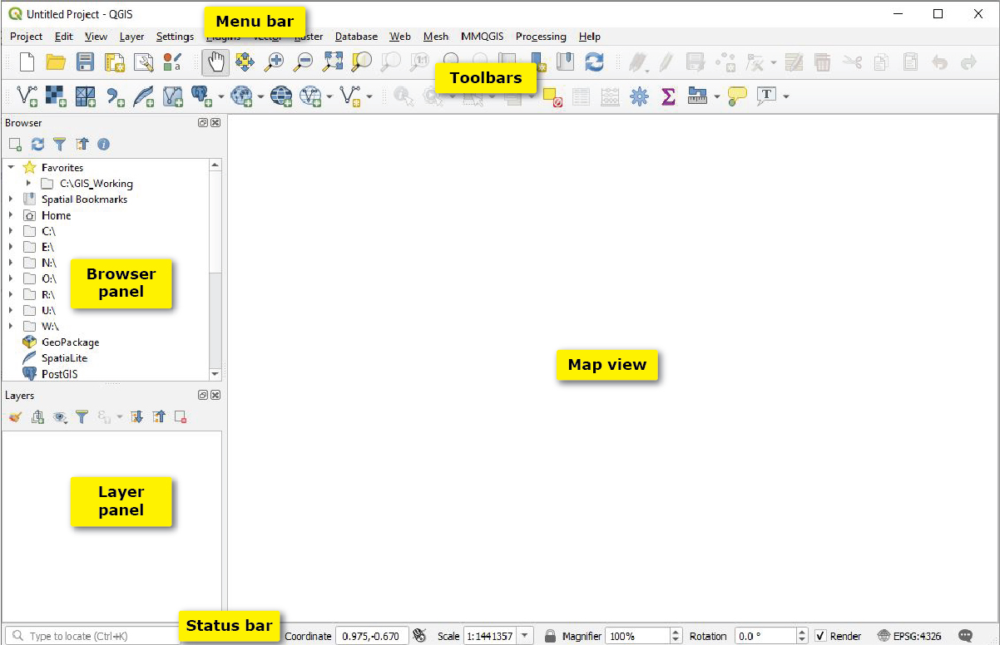

:::::::::::::::::::::::::::::::::::::: questions

- What is QGIS and why is it useful?
- How do I install QGIS on my system?
- How do I load spatial data into QGIS?
- How can I style and visualize data on a map?
- How do I export a finished map?

::::::::::::::::::::::::::::::::::::::::::::::::

::::::::::::::::::::::::::::::::::::: objectives

- Install QGIS successfully
- Understand the QGIS interface
- Load and explore spatial datasets
- Create and style a simple map
- Export a publication-ready map

::::::::::::::::::::::::::::::::::::::::::::::::

## What is QGIS?

**QGIS** is a free, open-source Geographic Information System (GIS) used to:
- Visualize spatial data
- Analyze geographic patterns
- Create professional-quality maps

::::::::::::::::::::::::::::::::::::: callout

### Why QGIS?
QGIS is widely used in academia, industry, and government — and it's completely free.

::::::::::::::::::::::::::::::::::::::::::::::::

---

## Installing QGIS

### Step 1: Download QGIS

1. Go to the official QGIS website:  
   👉 https://qgis.org

2. Click **Download Now**

3. Choose the appropriate version:
   - **Windows** → Use the *Standalone Installer*
   - **Mac** → Download the macOS package
   - **Linux** → Install via package manager (apt, yum, etc.)

---

### Step 2: Install QGIS

- Run the installer
- Keep default settings (recommended for beginners)
- Wait for installation to complete

---

### Step 3: Launch QGIS

- Open QGIS Desktop
- You should see the main interface

---

## Understanding the QGIS Interface

### Key Components:

- **Map Canvas** → where your map is displayed  
- **Layers Panel** → shows all loaded datasets  
- **Browser Panel** → access files on your system  
- **Toolbar** → tools for navigation and editing  

::::::::::::::::::::::::::::::::::::: callout

### Tip
If a panel is missing, enable it via:  
**View → Panels**

::::::::::::::::::::::::::::::::::::::::::::::::

---

## Troubleshooting

- **Colab:** Plots not showing? Add %matplotlib inline at the top (usually automatic).
- **Local:** package not found: Open terminal or code cell in jupyter notebook and `!pip` install package.
- **Need help?** Raise hand during workshop or check Carpentries Python setup guide.

You're all set. Happy visualizing!